# Refact Self-Hosting Guide 🚀

Complete guide to self-host Refact components: Server, Agent (Engine + GUI), and VSCode Plugin integration.

## Table of Contents

- [Overview](#overview)
- [Refact Server](#refact-server)
- [Refact Agent](#refact-agent)
- [VSCode Plugin Configuration](#vscode-plugin-configuration)
- [Architecture Options](#architecture-options)
- [Troubleshooting](#troubleshooting)

## Overview

Refact has three main components for self-hosting:

1. **Refact Server** - Self-hosted model inference server (Python, GPU-based)
2. **Refact Agent** - IDE integration with project intelligence (Rust-based)
3. **VSCode Plugin** - IDE interface that connects to Server or Agent

## Architecture Diagram

```mermaid
graph TB
    subgraph "Development Environment"
        VSCode["VSCode Plugin<br/>Port: IDE"]
    end

    subgraph "Refact Agent Engine (Rust)"
        Engine["Agent Engine<br/>Port: 8001<br/>• LSP Server<br/>• Project Intelligence<br/>• Custom Providers<br/>• Tiktoken Support"]
        Config["Config Files<br/>~/.config/refact/<br/>• providers.d/<br/>• customization.yaml"]
    end

    subgraph "Agent GUI (React/TypeScript)"
        GUI["Agent GUI<br/>Port: 5173<br/>• Configuration<br/>• Testing<br/>• Provider Management"]
    end

    subgraph "Refact Server (Python)"
        Server["Self-Hosted Server<br/>Port: 8008<br/>• Model Inference<br/>• GPU Processing<br/>• Local Models"]
        WebUI["Server Web UI<br/>Port: 8008<br/>• Model Management<br/>• Fine-tuning"]
    end

    subgraph "External APIs"
        Custom["Custom Provider<br/>• OpenAI-compatible<br/>• Tiktoken tokenizer"]
        OpenAI["OpenAI API"]
        Anthropic["Anthropic API"]
    end

    %% Connections
    VSCode -.->|"Bundled Agent (LSP)"| Engine
    VSCode -.->|"Option 2: Address URL :8008"| Server
    GUI -.->|"HTTP API :8001"| Engine
    Engine -.->|"Reads config"| Config

    %% Architecture Options
    Engine -.->|"Option 1: Cloud"| OpenAI
    Engine -.->|"Option 1: Cloud"| Anthropic
    Engine -.->|"Option 2: Gets caps :8008"| Server
    Engine -.->|"Option 3: Custom providers"| Custom
    Server -.->|"Web Interface"| WebUI

    %% Styling
    classDef agent fill:#e1f5fe
    classDef gui fill:#f0f8ff
    classDef server fill:#f3e5f5
    classDef external fill:#fff3e0
    classDef ide fill:#e8f5e8

    class Engine,Config agent
    class GUI gui
    class Server,WebUI server
    class Custom,OpenAI,Anthropic external
    class VSCode ide
```



## Refact Server

### Purpose
- Host and run AI models locally
- Fine-tuning capabilities
- Model inference (completion/chat)
- Web UI for model management

### Prerequisites
- **NVIDIA GPU** with CUDA 12 support
- **Docker** with NVIDIA GPU support
- **WSL 2** (Windows only)

### Installation

#### Method 1: Docker (Recommended)

```bash
# Install Docker with NVIDIA GPU support
# Follow: https://docs.nvidia.com/datacenter/cloud-native/container-toolkit/install-guide.html

# Run the server
docker run -d --rm --gpus all --shm-size=256m \
  -p 8008:8008 \
  -v refact-perm-storage:/perm_storage \
  smallcloud/refact_self_hosting:latest
```

#### Method 2: Refact Proxy (No GPU)

For third-party providers (OpenAI, Anthropic) or Ollama/vLLM:

```bash
git clone https://github.com/smallcloudai/refact.git
cd refact/refact-server
docker build -t refact_proxy -f Dockerfile.proxy .
docker run -d --rm --shm-size=256m \
  -p 8008:8008 \
  -v refact-proxy-perm-storage:/perm_storage \
  refact_proxy
```

#### Method 3: Manual Installation

```bash
git clone https://github.com/smallcloudai/refact.git
cd refact

# Basic installation
pip install .

# With GPU + Flash Attention (CUDA >= 8.0)
FLASH_ATTENTION_FORCE_BUILD=TRUE MAX_JOBS=4 INSTALL_OPTIONAL=TRUE pip install .

# Run server
python -m self_hosting_machinery.watchdog.docker_watchdog
```

### Access
- **Web UI**: `http://127.0.0.1:8008`
- **API**: OpenAI-compatible endpoints


## Refact Agent

### Purpose
- LSP server for IDE integration
- AST indexing and project analysis
- Vector database (VecDB) for RAG
- Tool integrations (git, debugger, browser)
- Custom provider support with tiktoken

### Components
- **Engine** (Rust) - Core LSP server
- **GUI** (React/TypeScript) - Web interface for configuration

### Installation

#### Prerequisites
- **Rust** (latest stable)
- **Node.js** and **npm** (for GUI)

#### Build Engine

```bash
cd refact-agent/engine

# Build debug version
cargo build

# Build release version
cargo build --release
```

#### Build GUI

```bash
cd refact-agent/gui

# Install dependencies
npm ci

# Start development server
REFACT_LSP_URL="http://localhost:8001" npm run dev
```

### Running Agent

#### Option 1: Agent with External APIs (BYOK)

For custom providers with tiktoken support:

```bash
cd refact-agent/engine

# Configure your custom provider first in ~/.config/refact/providers.d/custom.yaml
# Then run agent with self-hosted server as caps source
./target/debug/refact-lsp --address-url http://127.0.0.1:8008 --http-port 8001 --logs-stderr
```

#### Option 2: Agent + Self-Hosted Server (Hybrid)

```bash
# Terminal 1: Start self-hosted server (see Server section above)
docker run -d --rm --gpus all --shm-size=256m \
  -p 8008:8008 \
  -v refact-perm-storage:/perm_storage \
  smallcloud/refact_self_hosting:latest

# Terminal 2: Run agent pointing to server for caps
cd refact-agent/engine
./target/debug/refact-lsp --address-url http://127.0.0.1:8008 --http-port 8001 --logs-stderr
```

#### Running Engine + GUI

The GUI provides a web interface for configuring providers and testing functionality.

**For Option 1 (BYOK with External APIs):**

Terminal 1 (Server for caps):
```bash
# Start self-hosted server to provide caps
docker run -d --rm --shm-size=256m \
  -p 8008:8008 \
  -v refact-proxy-perm-storage:/perm_storage \
  smallcloud/refact_self_hosting:latest
```

Terminal 2 (Engine):
```bash
cd refact-agent/engine
./target/debug/refact-lsp --address-url http://127.0.0.1:8008 --http-port 8001 --logs-stderr
```

Terminal 3 (GUI):
```bash
cd refact-agent/gui
REFACT_LSP_URL="http://localhost:8001" npm run dev
```

**For Option 2 (Hybrid):**
Same as above, but the server in Terminal 1 also provides model inference.

### Access
- **Engine API**: `http://127.0.0.1:8001`
- **GUI**: `http://localhost:5173/`

### Custom Provider Configuration

Create provider config in `~/.config/refact/providers.d/custom.yaml`:

```yaml
api_key: your-api-key
chat_endpoint: https://api.example.com/v1/chat/completions
completion_endpoint: https://api.example.com/v1/chat/completions
enabled: true
chat_models:
  your-model:
    n_ctx: 128000
    tokenizer: /path/to/tiktoken/tokenizer.json  # tiktoken support!
    enabled: true
    supports_tools: true
    supports_agent: true
    default_temperature: 0.3
completion_models: {}
```

## VSCode Plugin Configuration

### Installation
1. Install [Refact.ai extension](https://marketplace.visualstudio.com/items?itemName=smallcloud.codify) from VSCode marketplace

### How VSCode Plugin Works

**Important**: The VSCode plugin **automatically includes** the refact-agent binary (`refact-lsp`)! You don't need to manually run the agent.

When you configure the plugin:
1. **Plugin launches bundled agent** - The `refact-lsp` binary starts automatically
2. **Agent connects to your server** - Uses your configured address for capabilities
3. **Agent provides enhanced features** - LSP, AST indexing, RAG, tools, tiktoken support
4. **You get the best of both worlds** - Local intelligence + your server's models

### Configuration

#### Option 1: Cloud Service (Default)
1. Open VSCode Settings
2. Go to **Extensions > Refact.ai Assistant > Settings**
3. Leave **Address URL** empty or set to `Refact`
4. Sign in with your Refact account

#### Option 2: Self-Hosted Server (Recommended)
1. Open VSCode Settings
2. Go to **Extensions > Refact.ai Assistant > Settings**
3. Set **Address URL** to: `http://127.0.0.1:8008` (or your server IP)
4. **What happens**: Plugin launches agent → Agent gets caps from your server → You get enhanced IDE features + local models

#### Option 3: External Agent (Advanced/Debug)
1. Manually run refact-agent: `./target/debug/refact-lsp --http-port 8001 --address-url http://127.0.0.1:8008`
2. Open VSCode Settings
3. Set **xDebug** to `1` (forces connection to external agent on port 8001)
4. **Use case**: Development, debugging, or custom agent configurations

### Testing

#### Test Your Self-Hosted Server
```bash
# Test server caps endpoint (should return JSON without errors)
curl http://127.0.0.1:8008/refact-caps

# Test server models
curl http://127.0.0.1:8008/v1/chat/completions \
  -H 'Content-Type: application/json' \
  -d '{
    "model": "qwen2.5/coder/1.5b/base",
    "messages": [{"role": "user", "content": "Hello"}],
    "max_tokens": 50
  }'
```

#### Test Agent (Advanced - Only if running external agent)
```bash
# Only works if you're running external agent with xDebug=1
curl http://127.0.0.1:8001/v1/caps
curl http://127.0.0.1:8001/v1/providers
curl http://127.0.0.1:8001/v1/ping
```

**Note**: The bundled agent in VSCode plugin runs on a random port and communicates via LSP, not HTTP directly.

## Architecture Options

### Option 1: Cloud Service (Default)
```
VSCode Plugin → Bundled Agent → Refact Cloud
```
- **Best for**: Getting started quickly
- **Features**: All agent features + cloud models
- **Requirements**: Internet connection, Refact account
- **Tiktoken**: ✅ Full support

### Option 2: Self-Hosted Server (Recommended)
```
VSCode Plugin → Bundled Agent → Your Server (:8008) → Local Models
```
- **Best for**: Privacy + full features
- **Features**: All agent features (LSP, AST, RAG, tools) + your local models
- **Requirements**: GPU for server, agent auto-launched by plugin
- **Tiktoken**: ✅ Supported for custom providers via agent
- **Setup**: Just set Address URL to your server in VSCode settings

### Option 3: External Agent + Custom Providers (Advanced)
```
VSCode Plugin → External Agent (:8001) → Custom APIs (OpenAI/etc)
```
- **Best for**: Custom providers, development, debugging
- **Features**: Full control over agent configuration
- **Requirements**: Manual agent setup, API keys
- **Tiktoken**: ✅ Full support for custom tokenizers
- **Setup**: Run agent manually + set xDebug=1 in VSCode

## Troubleshooting

### Common Issues

#### 404 Errors on /refact-caps
**Problem**: VSCode plugin getting 404 errors
**Solution**: The bundled agent needs a valid caps source

1. Verify your server is running and accessible:
```bash
# Test if server is responding
curl http://127.0.0.1:8008/refact-caps
```

2. Set correct Address URL in VSCode settings:
```
Extensions > Refact.ai Assistant > Settings > Address URL: http://127.0.0.1:8008
```

**Why this works**: The bundled agent needs caps from your server's `/refact-caps` endpoint.

#### "caps fetch failed: failed to parse address url" Errors
**Problem**: Agent can't load capabilities when no address-url provided
**Solution**: Provide a valid server URL in VSCode settings

1. Start your self-hosted server:
```bash
docker run -d --rm --shm-size=256m \
  -p 8008:8008 \
  -v refact-perm-storage:/perm_storage \
  smallcloud/refact_self_hosting:latest
```

2. Configure VSCode plugin with correct server URL:
```
Extensions > Refact.ai Assistant > Settings > Address URL: http://127.0.0.1:8008
```

**Important**: You don't need to manually run the agent - it's bundled in the VSCode plugin!

#### Tiktoken Not Working
**Problem**: Custom tokenizer not being used
**Solution**: Ensure tokenizer path in provider config points to valid tiktoken format:
```yaml
tokenizer: /path/to/tiktoken.model  # or tokenizer.json with tiktoken config
```

#### Port Already in Use
**Problem**: Port 8008 busy (server port)
**Solution**:
```bash
# Find process using port
lsof -i :8008
# Kill process or use different port for server
docker run -p 8009:8008 smallcloud/refact_self_hosting:latest
# Then update VSCode Address URL to http://127.0.0.1:8009
```

**Note**: The bundled agent uses random ports, so port conflicts are rare.

### Logs and Debugging

```bash
# Server logs
docker logs -f <container_id>

# VSCode plugin logs
# Open Output panel (View > Output) and select "Refact.ai Assistant"

# External agent logs (only if manually running agent)
./target/debug/refact-lsp --logs-stderr --verbose

# Check agent cache and config
ls ~/.cache/refact/
ls ~/.config/refact/
```

### Advanced: Running External Agent (Development Only)

If you need to run the agent manually (for development or custom configuration):

```bash
# 1. Build agent
cd refact-agent/engine
cargo build

# 2. Run agent with server for caps
./target/debug/refact-lsp --address-url http://127.0.0.1:8008 --http-port 8001 --logs-stderr

# 3. Configure VSCode to use external agent
# Set xDebug=1 in VSCode settings
```

### Supported Models

#### Server
- Llama 3.1/3.2 (1B-8B)
- Qwen2.5 Coder (0.5B-32B)
- Plus OpenAI/Anthropic via API keys

#### Agent (Bundled in VSCode Plugin)
- Any OpenAI-compatible API
- **Custom providers with tiktoken support**
- Bring-your-own-key (BYOK)
- Automatic LSP, AST indexing, RAG, tools

---

**Made with ❤️ for developers who want full control over their AI coding assistant.**
